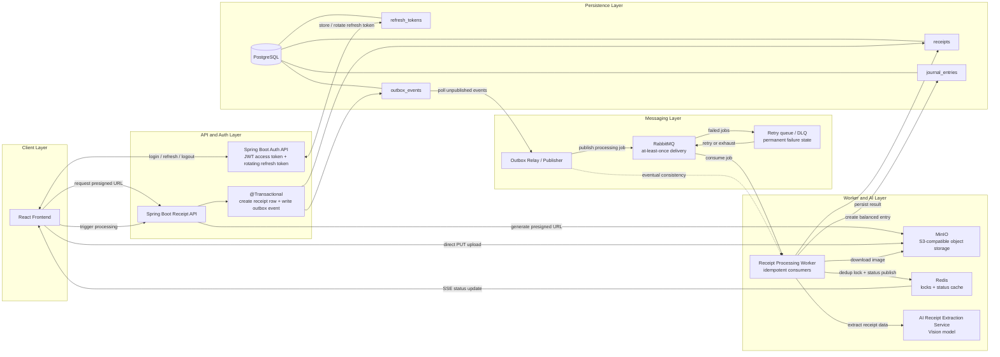

# LedgerLens

LedgerLens is a full-stack receipt intelligence application that turns uploaded receipt images into structured expense records, spending summaries, AI-generated insights, and double-entry ledger postings.

The project is built around a production-inspired backend flow: direct-to-object-storage uploads, asynchronous receipt processing, idempotent job submission, duplicate detection, queue-based workers, dead-letter retries, real-time lifecycle updates, and JWT-secured APIs. The focus is reliability and consistency rather than a simple CRUD workflow.

## Tech Stack

**Backend**
- Java 21
- Spring Boot 3
- Spring Security with JWT access and refresh tokens
- Spring Data JPA / Hibernate
- Flyway database migrations
- PostgreSQL
- Redis
- RabbitMQ
- MinIO object storage
- Resilience4j
- AI vision extraction API

**Frontend**
- React
- TypeScript
- Vite
- Lucide React

**Testing and tooling**
- JUnit 5
- Mockito
- Maven
- Docker Compose
- k6 load-test script

## What It Does

- Registers and authenticates users with stateless JWT auth.
- Issues rotating refresh tokens and supports token invalidation on logout or reuse detection.
- Generates short-lived MinIO presigned URLs so receipt images upload directly to object storage.
- Queues receipt processing through an outbox table and RabbitMQ.
- Extracts receipt fields with an AI vision service: merchant, date, category, subtotal, tax, tip, total, currency, and line items.
- Detects duplicate receipts using content hashes, database constraints, and Redis locks.
- Models receipt lifecycle states such as `PENDING`, `PROCESSING`, `COMPLETED`, `FAILED`, `DUPLICATE`, and `PERMANENTLY_FAILED`.
- Posts completed receipts into a balanced double-entry ledger.
- Streams receipt status updates to the frontend with Redis pub/sub and Server-Sent Events.
- Builds spending summaries by category and merchant.
- Generates AI-powered spending insights over recent receipt history.
- Includes a k6 load-test script for API throughput and latency checks.

## Architecture Flow



## Processing Pipeline

```text
Client upload
-> Presigned MinIO PUT URL
-> Receipt metadata commit
-> Outbox event persist
-> RabbitMQ dispatch
-> AI extraction worker
-> Merchant normalization
-> Category classification
-> Journal entry generation
-> SSE status broadcast
```

## Core Backend Flows

### Authentication

The authentication layer uses short-lived access tokens and longer-lived refresh tokens. Refresh tokens are stored server-side in Redis by JWT ID, which allows logout, token rotation, and refresh-token reuse detection.

Protected endpoints are authenticated by a custom JWT filter that extracts the user ID and email into the Spring Security context.

### Receipt Upload

The backend does not receive large receipt files directly. Instead, it creates a receipt record, generates a short-lived MinIO presigned URL, and returns that URL to the frontend. The browser uploads the file directly to MinIO, then asks the backend to process the receipt.

Upload creation supports an `X-Idempotency-Key` header so client retries do not create duplicate receipt records.

### Async Processing

Receipt processing is queued using the transactional outbox pattern. The API writes an outbox event in the same database transaction as the processing request. A scheduled publisher later reads unprocessed events and publishes them to RabbitMQ.

This avoids losing processing jobs if the application crashes after a database commit but before publishing to the message broker. The outbox relay marks events as processed only after successful publish, giving the system replayability, crash recovery, eventual consistency, and at-least-once delivery semantics.

### Duplicate Detection

Duplicate detection is layered:

1. A SHA-256 hash is computed from the receipt image bytes.
2. PostgreSQL is checked for an existing receipt with the same content hash for that user.
3. Redis is used as a distributed lock to prevent concurrent workers from processing the same image at the same time.
4. A database uniqueness constraint acts as the final safety net.

### Ledger Posting

When a receipt is completed, LedgerLens creates a balanced journal entry:

- Debit the expense account based on merchant category.
- Credit the cash/bank account.

The ledger service checks that total debits and credits match before saving the journal entry.

## Reliability Patterns

LedgerLens uses several backend patterns that are common in payment, finance, and high-scale SaaS systems:

- **Transactional outbox:** keeps database state and queue publication consistent.
- **Idempotency keys:** lets clients safely retry upload orchestration without creating duplicate receipt rows.
- **At-least-once queue delivery:** accepts possible duplicate delivery and handles it with consumer-side deduplication.
- **Dead-letter handling:** failed queue messages are routed through a DLQ retry path before becoming permanently failed.
- **Distributed duplicate lock:** uses Redis to prevent concurrent workers from processing the same receipt image at the same time.
- **Terminal state modeling:** receipts move into explicit final states instead of silently failing.
- **Double-entry validation:** ledger entries must balance before they are persisted.
- **External I/O isolation:** long-running MinIO and AI extraction calls do not hold database transactions open.
- **SSE status streaming:** clients get live processing updates without aggressive polling.

## API Overview

| Method | Endpoint | Description |
| --- | --- | --- |
| `POST` | `/api/auth/register` | Create account |
| `POST` | `/api/auth/login` | Sign in |
| `POST` | `/api/auth/refresh` | Rotate session tokens |
| `POST` | `/api/auth/logout` | Logout and blacklist token |
| `POST` | `/api/receipts/upload-url` | Create receipt and get upload URL |
| `POST` | `/api/receipts/{id}/process` | Queue receipt processing |
| `GET` | `/api/receipts` | List receipts |
| `GET` | `/api/receipts/{id}/status-stream` | Stream processing status |
| `DELETE` | `/api/receipts/{id}` | Delete one receipt |
| `DELETE` | `/api/receipts` | Delete user ledger |
| `GET` | `/api/expenses/summary` | Spending summary |
| `GET` | `/api/expenses/receipts/{id}` | Receipt details |
| `GET` | `/api/insights` | AI spending insights |

## Local Setup

### 1. Start infrastructure

```bash
docker compose up -d
```

This starts PostgreSQL, Redis, RabbitMQ, and MinIO.

### 2. Configure environment

Copy the example environment file:

```bash
cp .env.example .env
```

Then fill in the values for your local setup, especially:

```text
POSTGRES_USER=
POSTGRES_PASSWORD=
DB_USERNAME=
DB_PASSWORD=
JWT_SECRET=
MINIO_ACCESS_KEY=
MINIO_SECRET_KEY=
RABBITMQ_USERNAME=
RABBITMQ_PASSWORD=
ANTHROPIC_API_KEY=
```

The app requires local service credentials through `.env`; no real secrets should be committed. The app can start without a real Anthropic key, but receipt extraction and insights require one.

### 3. Run the backend

On macOS/Linux:

```bash
./mvnw spring-boot:run
```

On Windows:

```bash
mvnw.cmd spring-boot:run
```

The backend runs on:

```text
http://localhost:8080
```

### 4. Run the frontend

```bash
cd frontend
npm install
npm run dev
```

The frontend runs on:

```text
http://localhost:3000
```

## Tests

Run backend tests:

```bash
mvnw.cmd test
```

Current test coverage includes:

- auth controller behavior
- JWT generation and validation
- rate limiting
- receipt processing deduplication paths
- Spring Boot context loading

## Load Test Snapshot

A k6 load-test script is included in `scripts/load_test.js`. One benchmark run focused on p95 latency under concurrent traffic:

| Metric | Result |
| --- | --- |
| Concurrent users | 500 |
| Throughput | 576 requests/sec |
| Error rate | 0% |
| Overall p95 latency | 150 ms |
| Receipt listing p95 | 187 ms |
| Insights API p95 | 127 ms |
| Upload URL generation p95 | 163 ms |
| Requests processed | 204K+ |

These numbers are from a local benchmark snapshot and should be interpreted as environment-specific, not universal production guarantees.

## Project Structure

```text
src/main/java/com/ledgerlens
|-- auth        # registration, login, refresh, logout
|-- config      # external service configuration
|-- exception   # global API error handling
|-- insights    # spending insight generation
|-- ledger      # accounts, journal entries, double-entry posting
|-- merchant    # merchant normalization
|-- outbox      # transactional outbox publisher
|-- receipt     # upload, processing, extraction, summaries
|-- security    # JWT filters, token service, rate limiting
`-- user        # user entity and repository
```

## Design Notes

This project intentionally favors reliability and clear boundaries over a simple CRUD-only implementation. The receipt pipeline is split into API, storage, outbox, queue, worker, persistence, and ledger-posting stages so each failure mode can be handled independently.

The codebase also separates slow external I/O from database transactions. Receipt images are downloaded from MinIO and sent to the AI extraction service outside long-running transactional sections, while final database updates happen in focused persistence methods.

The main engineering concerns modeled in this project are distributed consistency, asynchronous workflow orchestration, retry safety, event durability, queue-driven scalability, ledger correctness, and operational visibility into background processing.

## License

This project is licensed under the MIT License.
